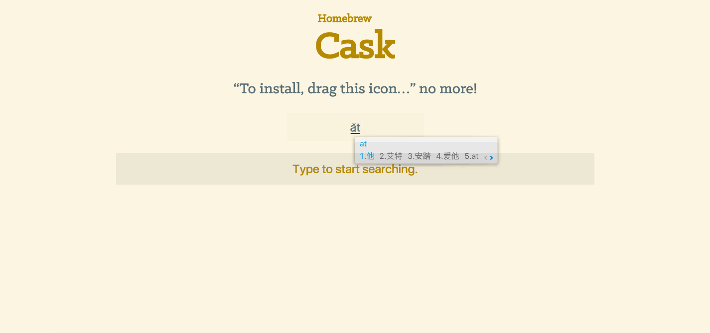

# Homebrew
Descriptions and usages of Homebrew

Homebrew 是一个强大的 OSX 专用包管理器，它可以帮助你轻松的安装各种扩展

## 安装

Homebrew是基于Ruby的,终端中使用`brew`来操作Homebrew

`/usr/bin/ruby -e "$(curl -fsSL https://raw.githubusercontent.com/Homebrew/install/master/install)"`

Homebrew 会将插件安装到独立目录 `/usr/local/Cellar`中，然后将文件软链接至 `/usr/local`    
安装完成后使用`brew doctor`命令来检查是否运行正常

## 常用命令介绍

```shell
xample usage:
  brew search [TEXT|/REGEX/]                    搜索
  brew (info|home|options) [FORMULA...]         显示插件信息 | 使用浏览器打开 | 显示插件安装选项
  brew install FORMULA...                       安装插件
  brew update                                   更新Homebrew自身
  brew upgrade [FORMULA...]                     更新插件，不指定插件则更新所有可更新的
  brew uninstall FORMULA...                     卸载
  brew list [FORMULA...]                        列出所有安装的插件信息
  brew cleanup                                  清理旧版本的缓存包

Troubleshooting:
  brew config
  brew doctor                                   检查是否运行正常
  brew install -vd FORMULA

Developers:
  brew create [URL [--no-fetch]]
  brew edit [FORMULA...]
  http://docs.brew.sh/Formula-Cookbook.html

Further help:
  man brew
  brew help [COMMAND]
  brew home
```


## 参考文档

[Homebrew 中文网](http://brew.sh/index_zh-cn.html)
[极客学院 Homebrew](http://wiki.jikexueyuan.com/project/mac-dev-setup/homebrew.html)


# Homebrew Cask

说道Homebrew那就得提下Homebrew Cask了，如果说Homebrew是安装命令行工具的管理器，那么Homebrew Cask就是安装图形化软件的管理器啦👌。

[Homebrew Cask](https://caskroom.github.io/)
[借助 Homebrew Cask，教你快速下载安装 Mac App 新姿势](http://sspai.com/32857)

由于Homebrew Cask 是基于Homebrew的,所以我们直接使用就可以了.可以到[caskroom](https://caskroom.github.io/search)搜索可以使用的软件



## 使用方法

```shell
brew cask install <software>    安装软件，如：brew cask install atom 
brew cask uninstall <software>  卸载软件
brew cask search [software]     列出可以被安装的软件，指定名称则查找相关软件
brew cask info <software>       显示软件信息
brew cask cleanup               删除下载包
brew cask list                  列出通过 Homebrew Cask 安装的包
brew cask update                更新Homebrew Cask
```
